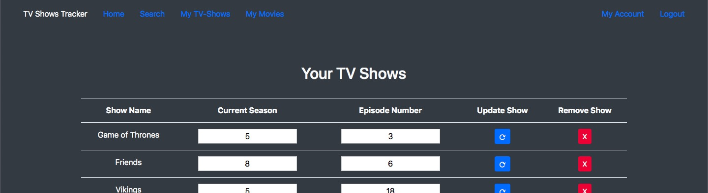

# Movies and TV Shows Tracker



This is a simple web application that queries the API at [TheMovieDB](https://www.themoviedb.org), with the help of the [TMDBSimple](https://pypi.org/project/tmdbsimple/) Wrapper to pull information about movies or tv-shows, and then lets you add them to a list.

TV-Shows can be manipulated as such :
- Add TV-Shows.
- Remove TV-Shows.
- Specify season you're on.
- Specify episode you're on.

Movies can be manipulated as such :
- Add Movies.
- Remove Movies.
- Select whether you have watched a movie yet or not.
- Give a rating (out of 100)

A user can also change his/her password in the \'My Account\' section after logging in.

## Links

The project is currently being hosted [here](https://s4g4r.pythonanywhere.com/) temporarily.

It is advised, if you wish to use this application, that you host it yourself, with the help of the instructions below.

## Installation Instructions

Start by downloading the repo as a ZIP your computer, and unzipping it (or, if you want, clone it).

The next step is to install `pipenv`, a package which is used to create virtual environments and install the necessary dependencies for our project.

In general, pipenv can be installed with :

`pip install pipenv` or (if you have homebrew) with `brew install pipenv`

Ensure that you have added pipenv to your PATH (usually necessary for Windows users).

To confirm that you have installed pipenv properly, type `pipenv` in a shell prompt, and it should print out a help page with all the available commands.

Next, head over to [TheMovieDB](https://www.themoviedb.org) and create a free account there. Head over to your account settings, and click on the API tab on the left side. Scroll down and you should see an API Key under the section **_API Key (v3 auth)_**. Save that key in a notepad file for now.

Now, navigate to your project folder through your shell and then, once you reach the root of the project, type the following :

`pipenv sync`

This might take a little time, as it will install all the necessary dependencies for your project.

Once finished, type in the following commands in order :

```
pipenv shell
python
import os
os.urandom(16)
```

You should get a piece of string of jumbled up characters. Copy it, and save it alongside your API Key in the notepad.

Now, open up the [.env](.env) file which is in the root of your project, with a text editor.

Here, there are two obvious modifications that we need to make. Replace the following :

`'your-api-key-here'` with the API Key that you had stored, and

`'super-secret-secure-key-here'` with the jumbled string you had generated in the previous step.

For safety, enclose both the above fields in double quotes ie. `" (PASTE HERE) "`. This is a very important step, so don't skip it, else you will get errors later.

Now, you can close the file and go back to your shell prompt. If you set up everything correctly, all you need to do now is type the following :

`pipenv shell flask run`

It should say something like \'Serving Flask app \"tv.py\" in the first line. Now, just open any browser and type in \'localhost\' in the browser, without the quotes. The application should be live!

To stop, press \'CTRL + C\' and then, type `exit`

## Uninstallation Instructions

Uninstalling is very simple.

Simply head to the root of the project with your shell, and type in :

`pipenv --rm`

Then, you can simply delete the project folder altogether.

You can further uninstall the pipenv package through :

`pip uninstall pipenv` or `brew uninstall pipenv` (depending on how you installed it).

## Built With

- Python 3.7 (Logic)
- Flask (Server)
- SQLAlchemy (Database)

## Contributing

Soon!

## Authors

- Sagar Vrajalal (Entirety)

## License

This project is licensed under the MIT License - see the [LICENSE.md](LICENSE.md) file for details.

## Acknowledgments

- Folks over at [TMDBSimple](https://github.com/celiao/tmdbsimple).
- And of course [TheMovieDB](https://www.themoviedb.org).
